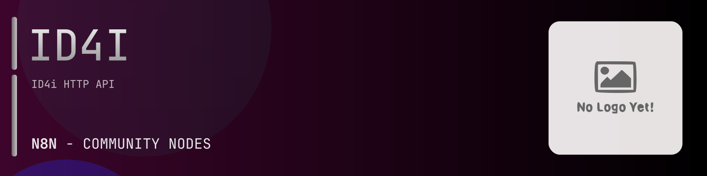

# @n8n-dev/n8n-nodes-id4i



[](https://www.npmjs.com/package/@n8n-dev/n8n-nodes-id4i)
[](https://opensource.org/licenses/MIT)

---

**Stop writing id4i API integrations by hand.**

Every time you connect n8n to id4i, you waste hours mapping endpoints, defining parameters, and debugging schemas. You copy-paste from docs, fix edge cases, and pray nothing breaks.

**What if connecting n8n to id4i took 5 minutes, not half a day?**

This node gives you **17+ resources** out of the box: **Accounts**, **Alias**, **API Keys**, **Auditing**, **Billing**, and 12 more: with full CRUD operations, typed parameters, and zero manual configuration.

---

## What You Get

- **Zero boilerplate**: Resources, operations, and fields are pre-configured and ready to use
- **Full CRUD**: Create, read, update, and delete support where the API allows it
- **Typed parameters**: No more guessing field types
- **Built-in auth**: API key authentication, ready to go
- **Declarative**: Native n8n performance, no custom execute() overhead

---

## Install

```bash
npm install @n8n-dev/n8n-nodes-id4i
```

**Or in n8n:**
1. **Settings → Community Nodes → Install**
2. Search: `@n8n-dev/n8n-nodes-id4i`
3. Click **Install**

---

## Quick Start

1. Install the node (above)
2. Add credentials: **id4i API** → paste your API key
3. Drag the **id4i** node into your workflow
4. Pick a resource → pick an operation → done.

That's it. No configuration files. No code. It just works.

---

## Resources

<details>
<summary><b>Accounts</b> (16 operations)</summary>

- Post Request password reset
- Put Verify password reset
- Post Register user
- Put Complete registration
- Post Verify registration
- Get List users and their roles
- Get Find users in organization
- Post Invite Users
- Delete Remove role s from user
- Get user roles by username
- Post Add role s to user
- Get List roles
- Get Retrieve organizations of user
- Get Find users
- Get Find by username
- Post Login

</details>

<details>
<summary><b>Alias</b> (5 operations)</summary>

- Get all aliases for the given GUID or Collection
- Delete Remove aliases from GUID or Collection
- Post Add alias for GUID or Collection
- Get Search for GUIDs by alias
- Get List all supported alias types

</details>

<details>
<summary><b>API Keys</b> (12 operations)</summary>

- Get Find API key by organization
- Post Create API key
- Get List all privileges
- Delete API key
- Get Show API key
- Put Update API keys
- Delete Remove privilege
- Get List privileges
- Post Add privilege
- Delete Remove id4ns of a privilege
- Get ID4ns of a privilege
- Post Add ID4ns of a privilege

</details>

<details>
<summary><b>Auditing</b> (1 operations)</summary>

- Get List change log entries of an organization

</details>

<details>
<summary><b>Billing</b> (2 operations)</summary>

- Get billing amount of services for a given organization
- Get billing positions for a given organization

</details>

<details>
<summary><b>Collections</b> (12 operations)</summary>

- Post Create collection
- Delete collection
- Get Find collection
- Patch Update collection
- Delete Remove elements from collection
- Get List contents of the collection
- Post Add elements to collection
- Delete ID4n properties
- Get Retrieve ID4n properties
- Patch ID4n properties
- Get multiple ID4n properties
- Get collections of organization

</details>

<details>
<summary><b>Guids</b> (14 operations)</summary>

- Post Create GUID s
- Get Retrieve GUIDs not in any collection
- Get Retrieve GUID information
- Patch Change GUID information
- Get Retrieve ID4n information
- Get all aliases for the given GUID or Collection
- Delete Remove aliases from GUID or Collection
- Post Add alias for GUID or Collection
- Get Retrieve collections of an ID
- Delete ID4n properties
- Get Retrieve ID4n properties
- Patch ID4n properties
- Post Import GS1 MAPP codes
- Get multiple ID4n properties

</details>

<details>
<summary><b>History</b> (5 operations)</summary>

- Get List history
- Post Add history item
- Get history item
- Patch Update history item
- Put Set history item visibility

</details>

<details>
<summary><b>Images</b> (1 operations)</summary>

- Get Resolve image

</details>

<details>
<summary><b>Messaging</b> (3 operations)</summary>

- Get Default Queue
- Patch Default Queue
- Post Enqueue a custom message

</details>

<details>
<summary><b>Meta Information</b> (1 operations)</summary>

- Get Retrieve version information about ID4i

</details>

<details>
<summary><b>Organizations</b> (24 operations)</summary>

- Get List countries
- Post Create organization
- Delete organization
- Get Find organization by ID namespace
- Put Update organization
- Delete Remove billing address
- Get Retrieve billing address
- Put Store billing address
- Get Retrieve address
- Put Store address
- Get collections of organization
- Delete organization logo
- Post Update organization logo
- Delete Remove partner
- Get partners of an organization
- Put Add partner
- Get List my privileges
- Get List users and their roles
- Get Find users in organization
- Post Invite Users
- Delete Remove role s from user
- Get user roles by username
- Post Add role s to user
- Get Retrieve organizations of user

</details>

<details>
<summary><b>Public Services</b> (9 operations)</summary>

- Get List public documents
- Get Read public document contents
- Get Retrieve a public document meta data only no content
- Get Shows the public history of the given GUID
- Get Resolve image
- Get Read public organization information
- Get Retrieve all public routes for a GUID
- Get Forward
- Get Resolve owner of id4n

</details>

<details>
<summary><b>Routing</b> (4 operations)</summary>

- Get Retrieve routing file
- Put Store routing file
- Get Retrieve current route of a GUID or ID4N
- Get Retrieve all routes of a GUID or ID4N

</details>

<details>
<summary><b>Storage</b> (13 operations)</summary>

- Get List documents
- Get List organization specific documents
- Post Create an document for an id4n
- Put an document for an id4n
- Delete a document
- Get Read document contents
- Get Retrieve a document meta data only no content
- Patch Update a document
- Get Read data from microstorage
- Put Write data to microstorage
- Get List public documents
- Get Read public document contents
- Get Retrieve a public document meta data only no content

</details>

<details>
<summary><b>Transfer</b> (3 operations)</summary>

- Put Transfer a GUID or collection obtaining it i e becoming the holder and if allowed also taking ownership
- Get Show transfer preparation information
- Put Prepare an object for transfer

</details>

<details>
<summary><b>Who Is</b> (1 operations)</summary>

- Get Resolve owner of id4n

</details>

---

## Why This Node?

**Without this node:**
- Hours of manual API integration
- Copy-pasting from id4i docs
- Debugging auth, pagination, error handling
- Maintaining your own client code

**With this node:**
- Install → configure → use. 5 minutes.
- Auto-generated from the official id4i OpenAPI spec
- Always up to date when the API changes
- Native n8n performance

---

## Auto-Generated
This node was auto-generated from the official **id4i** OpenAPI specification using
[@n8n-dev/n8n-openapi-node-ultimate](https://github.com/kelvinzer0/n8n-openapi-node-ultimate),
then validated against the live API so you get accurate types and real parameters, not guesswork.

When the id4i API updates, this node updates too.

---


## License

MIT © [kelvinzer0](https://github.com/n8n-code)
